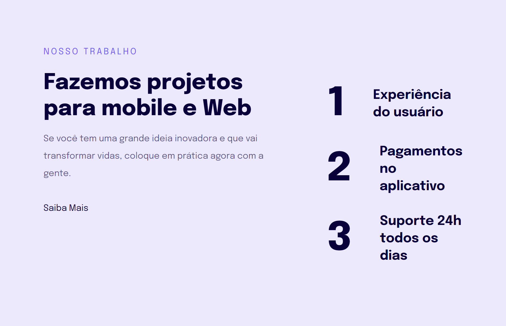

# Explorer - Projeto 04

> Projeto 04 Responsividade

Projeto desenvolvido durante o curso Explorer da Rocketseat, no desafio do Avançando no HTML e CSS. Nesse desafio era preciso recriar um layout responsivo utilizando o que foi aprendido nas aulas.

[Clique aqui para acessar](https://henriquetho.github.io/projeto04-responsiveness/)

## Tecnologias

    - HTML
    - CSS

## Contato

- henrique.ribeirotho@gmail.com
- [LinkedIn](https://www.linkedin.com/in/henrique-thomazin-068922162/)